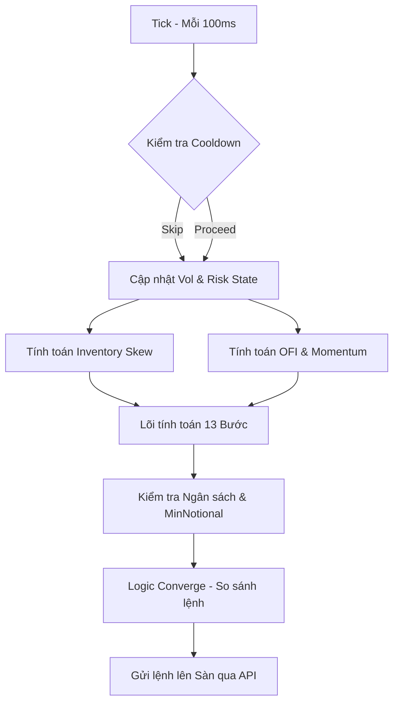

# Spike Maker v2 — Full Architecture Specification

## Overview

Spike Maker là một hệ thống market making chuyên nghiệp với cơ chế **spike-adaptive depth generation** (tạo độ sâu thích ứng biến động), **toxicity-based fill response** (phản ứng dựa trên độ độc hại của lệnh khớp), và **dynamic risk management** (quản lý rủi ro đa tầng).

Hệ thống gồm 3 lớp: Bot (Giao tiếp sàn) → Strategy (Luồng nghiệp vụ) → Engine (Lõi tính toán giá).

---

## 1. Bot Layer (`internal/bot/spike_maker.go`)

Lớp bao bọc (wrapper) để quản lý cấu hình và kết nối sàn.

| Thông số | Kiểu dữ liệu | Mô tả |
|---|---|---|
| `TickIntervalMs` | int | Khoảng thời gian giữa các chu kỳ xử lý (mặc định 100ms). |
| `SyncIntervalMin`| int | Chu kỳ đối soát trạng thái (reconcile) qua REST API (mặc định 60p). |
| `DrawdownWarnPct` | float64 | Ngưỡng drawdown bắt đầu cảnh báo (WARNING). |
| `DrawdownReducePct` | float64 | Ngưỡng drawdown để vào chế độ hồi phục (RECOVERY). |
| `MaxRecoverySize` | float64 | Hệ số size tối thiểu khi đang ở chế độ RECOVERY. |

---

## 2. Strategy Layer (`internal/strategy/spike_maker.go`)

### Quản lý Trạng thái & Rủi ro

**4 Chế độ Rủi ro (Risk Modes):**

| Mode | Trigger (Drawdown) | SizeMult | Cooldown (Fixed) | Hành vi |
|---|---|---|---|---|
| `NORMAL` | < 3% | 1.0 | 1s | Hoạt động bình thường. |
| `WARNING` | >= 3% | 0.8 | 5s | Thận trọng - giảm độ phơi nhiễm. |
| `RECOVERY` | >= 2% (từ đỉnh) | 0.3 – 1.0 | 30s | Phòng thủ nghiêm ngặt - ưu tiên bảo toàn NAV. |
| `PAUSED` | >= 5% | 0 | 1m | Hủy toàn bộ lệnh, tạm dừng báo giá. |

### Dynamic Requote Cooldown
Tính toán sớm ở mỗi tick để quyết định có cần cập nhật giá hay giữ lệnh cũ.

```
spikeCooldownMs = 100 × (1 + 4.5 × S^0.7) 
modeCooldownMs = GetFixedCooldownFromMode(currentMode) // 1s, 5s, 30s, 1m

cooldownMs = max(spikeCooldownMs, modeCooldownMs)
cooldownMs = min(cooldownMs, 60000) // Cap tối đa 1 phút
```
*Lưu ý: Cooldown được bỏ qua (bypass) khi có sự kiện Fill với Toxicity < 2.*

### Toxicity & Converge Logic
Phân tích các lệnh khớp để nhận diện các đợt tấn công trượt giá (Adverse Selection).

| Signal | Moderate (tox=1) | High (tox=2) |
|---|---|---|
| Spike score | S >= 1.5 | S >= 3.0 |
| Adverse price move | > 0.2% | > 0.5% |
| Same-side fills (30s) | >= 1% total depth | >= 3% total depth |
| Fill frequency | > 3 fills / 10s | > 5 fills / 10s |

**Converge Scope:**
- `tox=0`: Chỉ cập nhật 2 tầng đầu bên bị khớp.
- `tox=1`: Cập nhật 3 tầng đầu bên bị khớp.
- `tox=2`: **Dừng khẩn cấp 5s (Full Pause)**. Chờ thị trường ổn định để tránh bị cháy tài khoản hàng loạt.

---

## 3. Spike Depth Engine (`internal/engine/spike_depth.go`)

### 13-Step Engine Pipeline

1. **Microprice**: `(ask × bidSize + bid × askSize) / (bidSize + askSize)`. Bắt bài lực mua/bán ẩn.
2. **Fair Price**: `mid + 0.7 × (micro - mid) + 0.1 × OFI_tilt + 0.05 × mom_tilt`.
3. **Spike Score (S)**: `|ret| / sigma`. Đo lường độ "spike" của giá. Giới hạn ở 10.
4. **Spread Scaling**: `halfSpread = 5bps × (1 + 2 × S^0.7)`. Tự động nới rộng khi có biến.
5. **Ladder Distances**: `distances[i] = (halfSpread) + (maxDist - halfSpread) × (i/(n-1))^gamma`.
6. **Size Profile**: `weight = 1.2 ^ i`. Mỏng ở L0, dày ở L10 (đưa size về 1.0 nếu S > 3).
7. **Inventory Skew**: `skew = tanh(1.5 × invRatio)`. Điều chỉnh size dựa trên kho hàng.
8. **OFI Tilt (Delta)**: Dùng sự thay đổi độ sâu giữa 2 tick để dịch chuyển thang giá.
9. **Ninja Protection**: 
   - `additionalSpreadAsk = (AccBuyVol_30s / TargetDepth) × 100bps`
   - Chống việc bị "rỉa" lệnh nhỏ liên tục mà giá mid không chạy.
10. **Price Generation**: 
    - `bidPrice = fair × (1 - bidDist - addSpreadBid) × invPriceShift`
    - `askPrice = fair × (1 + askDist + addSpreadAsk) × invPriceShift`
11. **Queue Awareness**: Nếu vị trí hàng đợi > 70%, bot sẽ cải thiện giá (`price improve`).
12. **Extreme Protection (S >= 5)**: Thiết lập ±15bps no-quote zone quanh Fair Price.
13. **Compliance Toggle**:
    - `Capital-First`: Dùng `multiplier = 1 / (1 + 0.5 × S)` để nén size bảo vệ vốn.
    - `Compliance-First`: `multiplier = 1.0`. Đẩy toàn bộ dàn lệnh ra biên 1.95% để đạt KPI sàn.

---

## 4. Implementation Guards (Lớp bảo vệ khi triển khai)

### Anti-Self-Trade (STP)
- **Post-Only**: Tham số bắt buộc cho mọi lệnh. Sàn sẽ từ chối nếu lệnh mới khớp vào lệnh cũ của chính bot.
- **Internal Spread Guard**: Đảm bảo `bidPrice[0] < askPrice[0]` ít nhất 1 Tick.
- **STP Config**: Cấu hình `Self-Trade-Prevention = Cancel Maker` trên API sàn.

### Đảm bảo Compliance (Exchange Monitor)
Để 10 tầng lệnh luôn nằm trong vùng **±2%** mà sàn monitor (tính từ Mid):
- `askPrice[i] = min(askPrice[i], MidMarket × 1.02)`
- `bidPrice[i] = max(bidPrice[i], MidMarket × 0.98)`
- L10 được neo tại **1.95%** để làm vùng đệm an toàn.

### Quantization & Precision
- Toàn bộ tính toán phải dùng thư viện số thực chính xác chuyên dụng (`Decimal`).
- Giá phải được làm tròn theo `TickSize` và Size phải làm tròn theo `LotSize` của sàn.
- Kiểm tra `minNotional` của sàn để tránh lệnh "rác" bị từ chối.

---

## 5. Execution Flow Summary (Mermaid)

